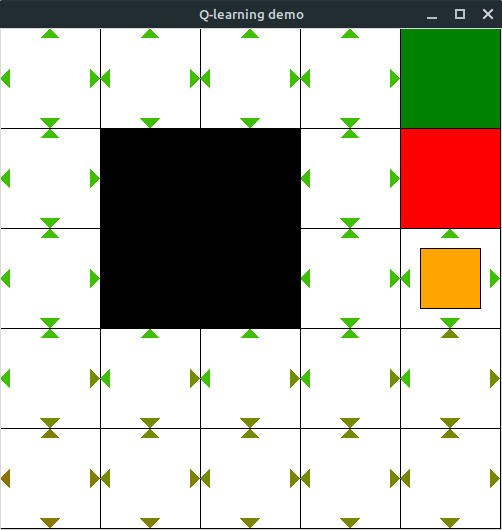

# AI Tools for teaching

This repo contains various useful tools that may be used in a typical AI course.

## Value Iteration Grid

This is David Poole's [Java Applet](https://www.cs.ubc.ca/~poole/demos/mdp/vi.html) for running Value Iteration on a grid.
 
The one here is a port to stand-alone Java application done by Sebastian Sardina in 2020, given that Java Applets have been deprecated and they are not supported anymore by most browsers (e.g., does not work in Firefox).

Check corresponding [README.md](value-iteration/README.md) for more details.

![[]](value_iteration/screenshot.png)

## Q Learning Demo

This is the code for _"How to use Q Learning in Video Games Easily"_ by Siraj Raval on [Youtube](https://youtu.be/A5eihauRQvo).

This version have been ported to Python 3.0. The original source code for Python 2.7 can be found [here](https://github.com/erilyth/Q-Learning-on-Mazes).

